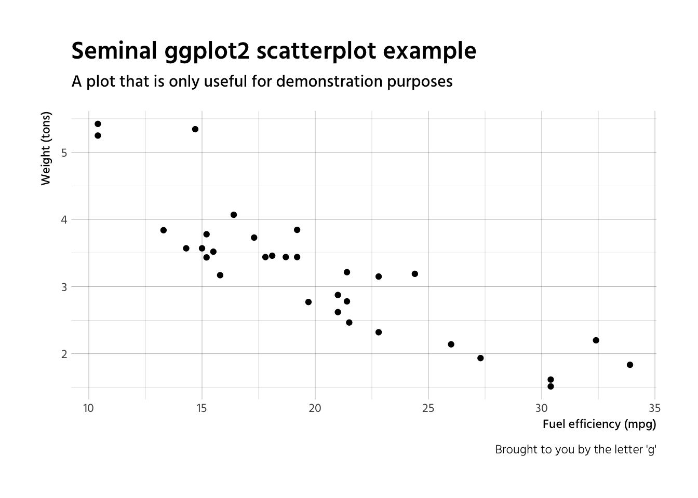

Hind font Based `ggplot2` Themes.
---------------------------------

[](http://www.repostatus.org/#active) [](/commits/master)

[](https://travis-ci.org/bhaskarvk/fontHind) [](https://ci.appveyor.com/project/bhaskarvk/fontHind)

[](https://opensource.org/licenses/MIT)

[](https://cran.r-project.org/) [](http://cran.rstudio.com/web/packages/fontHind/index.html) [](https://cran.r-project.org/package=fontHind) [](commits/master)

This is an add-on pacakge for [hrbrthemes](https://github.com/hrbrmstr/hrbrthemes) pacakge. It provides ggplot2 theme based on [Hind font](https://fonts.google.com/specimen/Hind).

Hind is an Open Source typeface supporting the Devanagari and Latin scripts. Developed explicitly for use in User Interface design, the Hind font family includes five styles. More information about the font can be found at <https://fonts.google.com/specimen/Hind>.

The package is released under MIT License while the Hind fonts are released under the [SIL Open Font License 1.1](http://scripts.sil.org/cms/scripts/page.php?site_id=nrsi&id=OFL).

### Installation

``` r
install.packages('hrbrthemes')

if(!require(devtools)) {
  install.packages("devtools")
}
devtools::install_github('bhaskarvk/fontHind')
fontHind::import_hind() # Required only once
```

The `fontHind::import_hind()` call will import the Hind fonts in your `extrafont` database. You will then need to install the Hind fonts in the directory mentioned in the output of that call as per your operating system's way of installing fonts.

### Usage

#### Hind Fonts

``` r
library(ggplot2)
library(fontHind)

gg <- ggplot(mtcars, aes(mpg, wt)) +
  geom_point() +
  labs(x="Fuel efficiency (mpg)", y="Weight (tons)",
       title="Seminal ggplot2 scatterplot example",
       subtitle="A plot that is only useful for demonstration purposes",
       caption="Brought to you by the letter 'g'")

gg + theme_ipsum_hind()
```



### Code of Conduct

Please note that this project is released with a [Contributor Code of Conduct](CONDUCT.md). By participating in this project you agree to abide by its terms.
